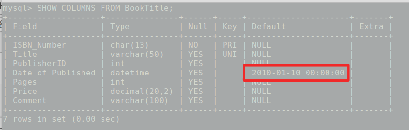

# Experiment #2
In this experiment we are going to change tables structure in order to:
- Set a specific set of columns as a table `primary key`.
- Set one or more set of columns `uniq`.
- Determine `default` value for columns.
 
## 1- Creating exp1 tables again without any constraints.

Here I copied all from create-table queries in [exp1.sql](../exp1/exp1.sql) file to
`exp2_1.sql` file and deleted every constraints from create table
query body, such as NUT NULL, REFERENCE and etc.

`exp2_1.sql` content:
```sql
CREATE DATABASE BOOK_961120013;
USE BOOK_961120013;

CREATE TABLE Publisher(
	PublisherID INT NOT NULL, 
	PublisherName VARCHAR(50) NOT NULL
);

CREATE TABLE BookTitle(
	ISBN_Number NCHAR(13) NOT NULL ,
	Title VARCHAR(50) NOT NULL,
	PublisherID INT NOT NULL,
	Date_of_Published DATETIME,
	Pages INT,
	Price DECIMAL(20,2), 
	Comment VARCHAR(100));

CREATE TABLE Author(
	AuthorID INT NOT NULL,
	AuthorFirstName VARCHAR(20) NOT NULL, 
	AuthorLastName VARCHAR(30) NOT NULL
);

CREATE TABLE Category(
	CategoryID INT NOT NULL,
	CategoryDescription VARCHAR(50) NOT NULL
);

CREATE TABLE Book_Author(
	ISBN_Number NCHAR(13) NOT NULL,
	AuthorID INT NOT NULL
);	

CREATE TABLE Book_Category(
	ISBN_Number NCHAR(13) NOT NULL,
	CategoryID INT NOT NULL
);

```

Then we need to delete the old perfect BOOK_961120013 database 
by following query in MySQL command line.

```sql
DROP DATABASE BOOK_961120013;
```

Then we need to execute `~/exp2_1.sql` content by following command:

```bash
sudo mysql < ~/exp2_1.sql
```

### Insert sample records

Then we are going to add some test records to tables. There’s some
insert queries in `sample_records.sql` file:

```sql
USE BOOK_961120013;

-- Insert sample publisher
INSERT INTO Publisher VALUES (1, "Publisher A");
INSERT INTO Publisher VALUES (2, "Publisher B");

-- Insert sample bookTitle
INSERT INTO BookTitle VALUES ("1234567891234", "The art of thinking clearly", 1, '2013-11-05 14:29:36',
 1000, 100, "The Art of Thinking Clearly is a 2013 book by the Swiss writer.");

INSERT INTO BookTitle VALUES ("1234567891235", "The Alchemist", 2, '1988-11-05 14:29:36',
 190, 21, "The Alchemist is a novel by Brazilian author Paulo Coelho.");

-- Insert sample Author
INSERT INTO Author VALUES (1, "Paulo", "Coelho");
INSERT INTO Author VALUES (2, "Rolf", "Dobelli");

-- Insert sample Category
INSERT INTO Category VALUES (1, "Novel");
INSERT INTO Category VALUES (2, "Psychology");

-- Insert sample Book_Author
INSERT INTO Book_Author VALUES ("1234567891234", 2);
INSERT INTO Book_Author VALUES ("1234567891235", 1);

-- Insert sample Book_Category
INSERT INTO Book_Category VALUES ("1234567891234", 2);
INSERT INTO Book_Category VALUES ("1234567891235", 1);

```

We would execute `~/sample_records.sql` it by following command:

```bash
sudo mysql < ~/sample_records.sql
```

Alright, let’s take a look at the tables.


## 2- Primary key

Determine primary key for each table.
Primary keys are highlighted:

Author (`AuthorID`, AuthorFirstName , AuthorLastName )

BookTitle (`ISBN_Number`, Title, PublisherID , Date_of_Published , Pages , Price ,Comment )

Publisher (`PublisherID`, PublisherName )

Category (`CategoryID`, CategoryDescription )

Book_Author (`ISBN_Number, AuthorID` )

Book_Category(`ISBN_Number, CategoryID`)

### Solvation
We would store the queries in `alter_pk.sql` file:

```sql
USE BOOK_961120013;

ALTER TABLE Publisher
ADD PRIMARY KEY (PublisherID);

ALTER TABLE BookTitle
ADD PRIMARY KEY (ISBN_Number); 

ALTER TABLE Author
ADD PRIMARY KEY (AuthorID); 

ALTER TABLE Category
ADD PRIMARY KEY (CategoryID); 

ALTER TABLE Book_Author
ADD PRIMARY KEY (ISBN_Number, AuthorID);

ALTER TABLE Book_Category
ADD PRIMARY KEY (ISBN_Number, CategoryID);    
```

Then we execute the `~/alter_pk.sql` file by following command:

```bash
sudo mysql < ~/alter_pk.sql 
```

Let’s check tables’ columns out to see the difference:


## 3- Uniq

Apply appropriate limitations on “Publisher” and
"BookTitle" that makes `PublisherName` and `Title` fields
unique.

### Solvation

The queries of this part are in `alter_uq.sql` file:

```sql
USE BOOK_961120013;

ALTER TABLE Publisher
ADD UNIQUE (PublisherName); 

ALTER TABLE BookTitle
ADD UNIQUE (Title); 
```

Then we execute the `~/alter_uq.sql` file by following command:

```bash 
sudo mysql < ~/alter_uq.sql
```

Let’s check tables’ columns out to see the difference:


## 4- Default 

Adjust `Date_of_Published` field so it’s default value become
`2010-1-10`.

### Solvation

The queries of this part are in `alter_default.sql` file:

```sql
USE BOOK_961120013;

ALTER TABLE BookTitle
ALTER Date_of_Published SET DEFAULT '2010-1-10';
```

Execute the `~/alter_default.sql` file by following command:

```bash 
sudo mysql < ~/alter_default.sql
```

Alright let see the happened difference:


