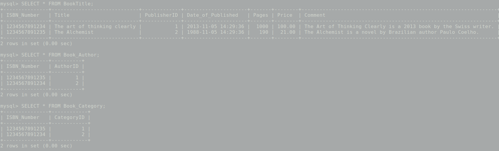
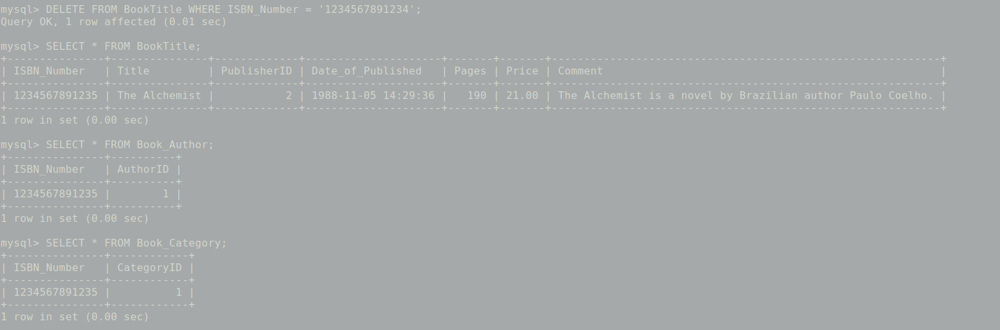

# Experiment #3
In this experiment we are going to change tables structure in order to:
- Reference some column to another column in another table as `foreign key`. 
- Add `check` constraint to some column so that the column
 only accept values that have some specific conditions. 


## 1- Determine Foreign key in each table.

Highlighted columns in each table is referring to a column in another
table, which means they should be defined as foreign key.

1- Author (AuthorID, AuthorFirstName , AuthorLastName):
- No foreign key.

2- Publisher (PublisherID, PublisherName)
- No foreign key.

3- Category (CategoryID, CategoryDescription)
- No foreign key.

4- BookTitle (ISBN_Number, Title, `PublisherID`, Date_of_Published, Pages, Price, Comment)
- PublisherID references to PublisherID column at Publisher
table.

5- Book_Author (`ISBN_Number`, `AuthorID`)
- ISBN_Number references to ISBN_Number column at
Booktitle table.
- AutherID references to AutherID colums at Auther table.

6- Book_Category (`ISBN_Number`, `CategoryID`)
- ISBN_Number references to ISBN_Number column at
Booktitle table.
- CategoryID references to CategoryID column at Category
table. 

## 2- Adjust foreign keys in cascade form.

Here’s the relevant SQL code in [exp3_1.sql](exp3_1.sql) file:

```sql
USE BOOK_961120013;


ALTER TABLE BookTitle
ADD FOREIGN KEY(PublisherID) REFERENCES Publisher(PublisherID) ON DELETE CASCADE ON UPDATE CASCADE;


ALTER TABLE Book_Author
ADD FOREIGN KEY (ISBN_Number) REFERENCES BookTitle(ISBN_Number) ON DELETE CASCADE ON UPDATE CASCADE;

ALTER TABLE Book_Author
ADD FOREIGN KEY (AuthorID) REFERENCES Author(AuthorID) ON DELETE CASCADE ON UPDATE CASCADE;


ALTER TABLE Book_Category
ADD FOREIGN KEY (ISBN_Number) REFERENCES BookTitle(ISBN_Number) ON DELETE CASCADE ON UPDATE CASCADE;

ALTER TABLE Book_Category
ADD FOREIGN KEY (CategoryID) REFERENCES Category(CategoryID) ON DELETE CASCADE ON UPDATE CASCADE;
```

Then we execute the SQL file:

```bash
sudo mysql -v < exp3_1.sql
```

Now let’s test cascade delete for ISBN_Number column of BookTitle
table.
As you see in following picture, a Book_Author record with
AuthorID of `2` and a Book_Category record with CategoryID of `2`
are referring to a BookTitle record with ISBN_Number of
`1234567891234`.



Since we have adjust AuthorID foreign key and CategoryID foreign
key to be deleted cascadely. So as you see in following picture when
we delete BookTitle record with ISBN_Number of
`1234567891234`, Book_Author record with AuthorID of `2` and
Book_Category record with CategoryID of `2` get deleted
automatically:



Other cascade fields would works exactly like this example when we delete or update them.

## 3- Add constraints to check following limitations:

### A: From Book_Author table, ISBN_Number field value must contain 9 digits followed by each other:

Since `ISBN_Number` field of `Book_Author` is a reference to the
same field in `BookTitle` table, it’s better to adjust constraint on
BookTitle table so the constraint will be adjusted on all
`ISBN_Number` fields referring to this one.
By the way since (unfortunately) MySQL doesn’t support range
of values in wildcards, I used `RLIKE` instead `LIKE` statement which
uses regex instead wildcard.
The related query is stored in [exp3_3_A.sql](exp3_3.sql) file.

```sql
ALTER TABLE BookTitle
ADD CHECK (ISBN_Number RLIKE "^[0-9]{9}$");
```

### B: From BookTitle table, the value of Date_of_Published field is not suppose to be bigger than date of now.

```sql
ALTER TABLE BookTitle
ADD CHECK (Date_of_Published <= NOW()); 
```

This part's related code is stored in [exp3_3.sql](exp3_3.sql) file.
After deleting (or changing) records which are violating the new constraints, we
execute the `exp3_4_A.sql` file: 

```bash
sudo mysql < 
```

