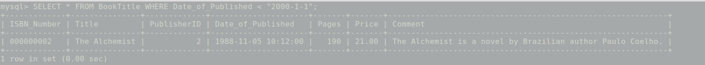

# Experiment #4
In this experiment we are going to retrieve preferred data from our database.

## Write appropriate queries for each question according to last experiment table.

## 1- Insert desired records into tables.

There is insert sample records in [sample_records_2.sql](sample_records_2.sql):

```sql
USE BOOK_961120013;

-- Note that this samples includes last sample records(sample_records_1.sql)
-- Insert sample publisher
INSERT INTO Publisher VALUES (1, "Publisher A");
INSERT INTO Publisher VALUES (2, "Publisher B");
INSERT INTO Publisher VALUES (3, "Publisher C");
INSERT INTO Publisher VALUES (4, "Publisher D");

-- Insert sample bookTitle
INSERT INTO BookTitle VALUES ("000000001", "The art of thinking clearly", 1, '2013-11-05 14:29:36',
 1000, 100, "The Art of Thinking Clearly is a 2013 book by the Swiss writer.");

INSERT INTO BookTitle VALUES ("000000002", "The Alchemist", 2, '1988-11-05 10:12:00',
 190, 21, "The Alchemist is a novel by Brazilian author Paulo Coelho.");

-- Insert sample Author
INSERT INTO Author VALUES (1, "Paulo", "Coelho");
INSERT INTO Author VALUES (2, "Rolf", "Dobelli");
INSERT INTO Author VALUES (3, "Rolf", "J. smit");
INSERT INTO Author VALUES (4, "Sajad", "Khosravani");

-- Insert sample Category
INSERT INTO Category VALUES (1, "Novel");
INSERT INTO Category VALUES (2, "Psychology");

-- Insert sample Book_Author
INSERT INTO Book_Author VALUES ("000000001", 2);
INSERT INTO Book_Author VALUES ("000000002", 1);

-- Insert sample Book_Category
INSERT INTO Book_Category VALUES ("000000001", 2);
INSERT INTO Book_Category VALUES ("000000002", 1);
```

We run the SQL file as simple as writing following command in bash:

```sql
sudo mysql < sample_records_2.sql
```

## 2- Retrieve distinct Authors’ first names.


## 3- Retrieve books which has been published before 1/1/2000.


## 4- Retrieve authors which their last names include “smit”.


## 5- Retrieve books’ titles ordered by their published date.
